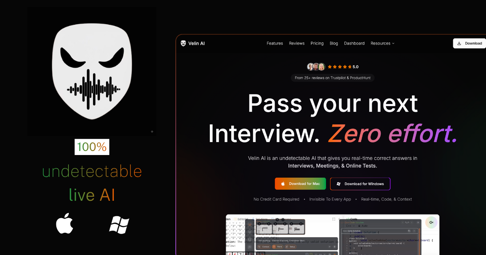
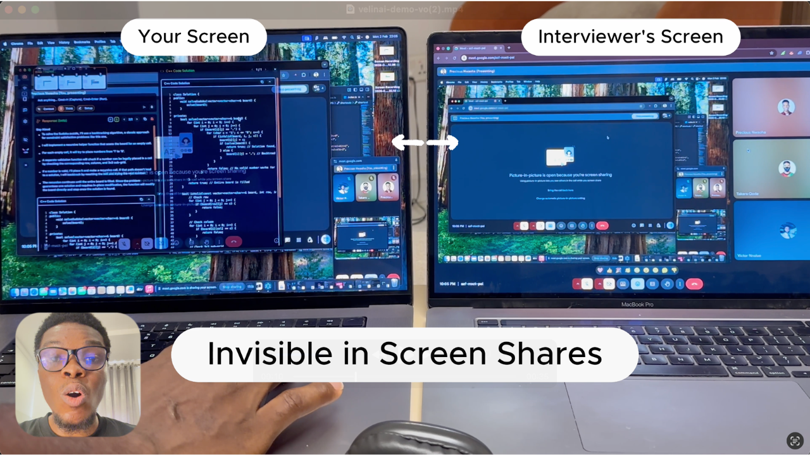
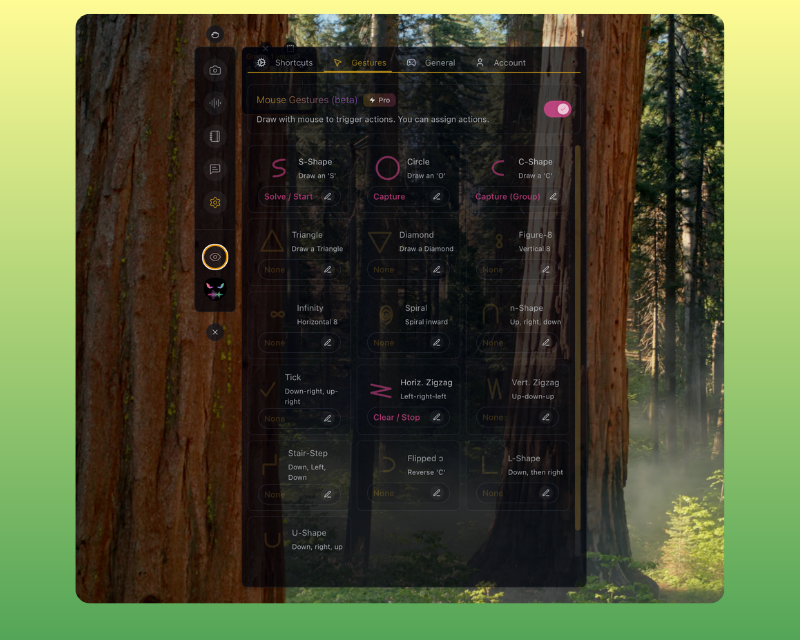
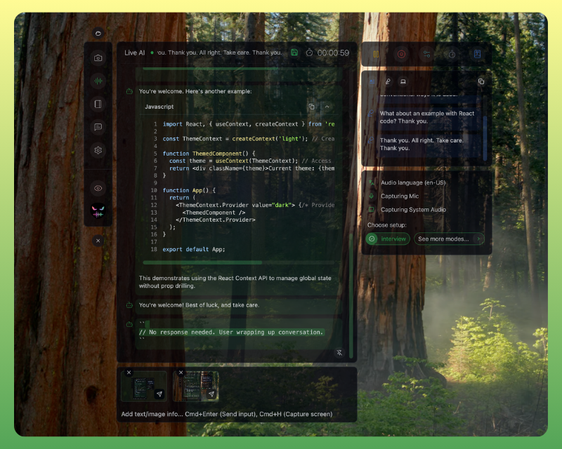
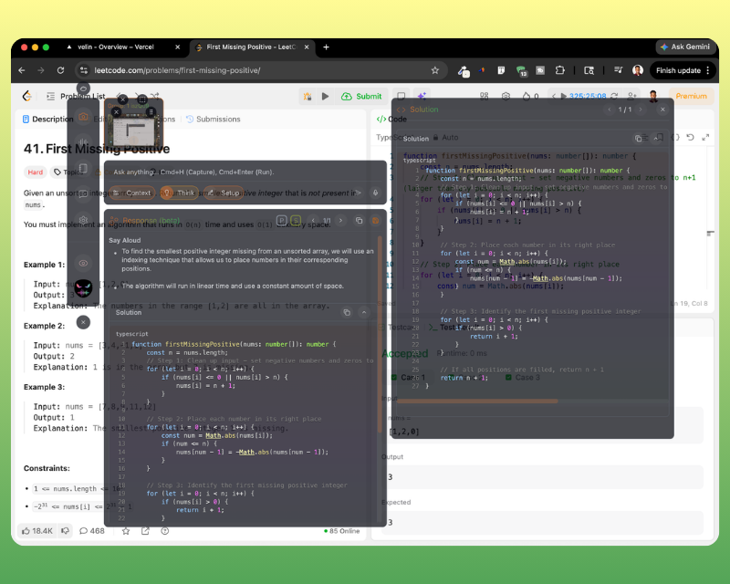
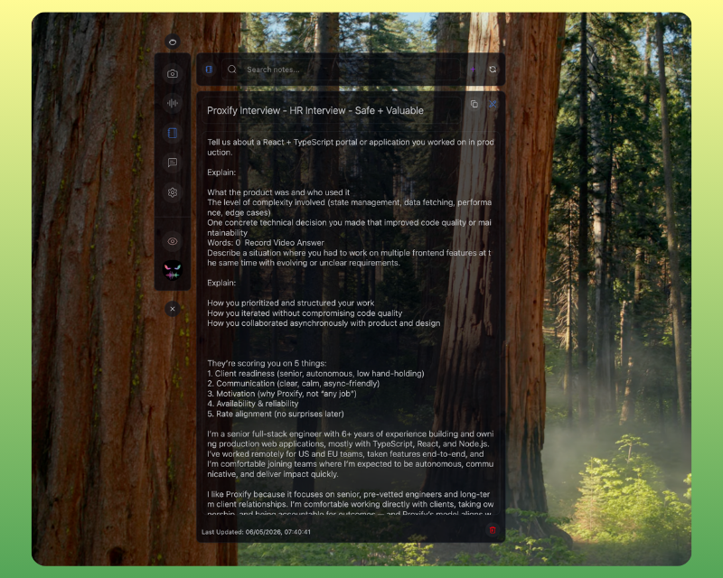

# Velin AI

**The AI assistant that doesn't exist — until you need it.**

---

<!-- DEMO GIF — replace with actual recording -->
<!-- Suggested: screen capture of the app appearing/disappearing + solving a problem invisibly -->
<!--  -->

---

## What is Velin AI?

Velin AI is an **undetectable AI assistant** that floats over your entire desktop — invisible to every screen recorder, meeting app, and proctoring platforms. It sees your screen, hears your calls, and gives you accurate AI answers in real time. Nobody else can see it.

> Invisible to Meet, Zoom, Teams, etc. Invisible to Leetcode, Codility, Hackerrank, etc. Invisible to Honorlock. Invisible to you — until you call it.

---

## ✦ Core Capabilities

<table>
<tr>
<td width="50%">

### 👁️ OS-Level Invisibility
Velin AI operates at the operating system level. It doesn't appear in screen recordings, screen shares, the dock, the menu bar, or the activity monitor. It simply doesn't exist to other apps.

**Verified undetectable on:**
Zoom · Google Meet · Microsoft Teams · Honorlock · and every other sharing or proctoring tool.

</td>
<td width="50%">

<!-- SCREENSHOT — app invisible while zoom is running -->
<!-- Suggested: side-by-side of Zoom recording vs actual screen -->
<!--  -->

</td>
</tr>
<tr>
<td width="50%">

<!-- SCREENSHOT — gesture drawing an S-shape -->

</td>
<td width="50%">

### 🖱️ Mouse Gesture Control
Draw shapes anywhere on your screen to trigger AI — no keyboard required, no suspicious keystrokes. 13 unique gesture shapes map to any action you want.

Draw an **S** → Solve. Draw a **Circle** → Capture & Analyze. Draw an **infinity** → Switch modes. All while your hands appear completely idle.

</td>
</tr>
<tr>
<td width="50%">

### 🎙️ Live Interview Mode
Velin AI listens to both sides of a call — your microphone and system audio — and provides real-time AI answers as the conversation happens. No typing. No searching. Just answers, floating invisibly on your screen.

Perfect for live interviews, sales calls, client meetings, and online exams.

</td>
<td width="50%">

<!-- SCREENSHOT — live session panel with transcription -->

</td>
</tr>
<tr>
<td width="50%">

### 📓 On-Screen Test or Assessment
Captures your screen, analyzes it, and provides answers to whaterver problem is identified on the screen. Works on any topic, very fast, and accurate. This makes Velin AI uniquely powerful for test/assessment based tasks. 

</td>
<td width="50%">

<!-- SCREENSHOT — notes panel shown over a document -->

</td>

</tr>

<tr>
<td width="50%">

<!-- SCREENSHOT — notes panel shown over a document -->

</td>
<td width="50%">

### 📓 Invisible Notes & Cheatsheets
Save any AI response as a persistent note. Notes float over your screen just like the app — invisible to recorders. Use them as live cheatsheets during interviews, exams, or presentations.

</td>
</tr>
</table>

---

## ✦ Everything Else

| Feature | Description |
|---|---|
| **Say Aloud & Follow-up Answers** | Velin AI answers as you. It includes what you should say aloud, comments, and possible follow-up (e.g time complexity) |
| **AI Screenshot Analysis** | Capture any part of your screen and get instant AI analysis — code, diagrams, questions, anything |
| **Context Injection** | Provide your own background context to get more accurate, personalized answers |
| **Invisible in Dock & Menubar** | You will not find Velin AI anywhere in your dock or menubar |
| **Thinking Mode** | Toggle between speed-optimized and deep-reasoning AI modes |
| **Full Coding Support** | Get code, explanations, and debugging in any programming language |
| **57+ Languages** | Understands and responds in your language |
| **Click-Through & Transparent** | Mouse passes trhough the app, it never steals focus, never becomes the active window — you interact with it transparently |
| **Keyboard Shortcuts** | Every action has a shortcut. Nothing requires touching the app visually |
| **Never Active Window** | Clicking or typing in Velin AI does not make the app the active window |
| **Undetectable in Activity Monitor** | No one will know you are using Velin AI even if you show them your activity monitor |
| **False Focus & Typing** | When Clicking of Typing the Cursor still remains in the app underneat Velin AI |
| **Parallel AI Jobs** | Run multiple capture-and-solve tasks simultaneously without waiting |
| **Customizable Everything** | Gestures, AI mode, theme, shortcuts — all configurable from settings |

---

## ✦ Who Uses Velin AI?

| 🎓 Students | 💼 Professionals | 💻 Developers | 📞 Sales |
|---|---|---|---|
| Ace proctored exams | Dominate live interviews | On-screen Q&A (Leetcode-type) | Convert leads faster with live coaching |
| Use invisible cheatsheets | Get real-time meeting intel | Answers with code + "say aloud" | Know exactly what to say, when to say it |

---

## ✦ Privacy, Control & Customization 

- Velin AI only listens when you start a live session, and Live sessions stop as soon as you leave the live mode view.
- Your conversation and responses are never saved or used outside of your invisible notes.
- Everything from commands, apperance, ai setup/modes, mouse gestures, etc, is fully customizable by you.

---

## ✦ Platform Support

| Platform | Minimum Version | Invisibility |
|---|---|---|
| **macOS** | 12 Monterey+ | ✅ Full OS-level |
| **Windows** | Windows 10+ | ✅ Full OS-level |

---

## ✦ Get Started

**[→ Download Velin AI - Mac & Windows](https://velinai.live/download)**  
**[→ View Velin AI Pricing (Most Affortable Undetectable Real-time AI + Lifetime Purchase)](https://velinai.live/pricing)**  
**[→ Velin AI Installation Guide](https://velinai.live/installation-guide)**  
**[→ Watch Videos & Demos](https://velinai.live/videos)**  
**[→ Contact Creator - Takara](https://velinai.live/contact)**

---

## ✦ Releases

This repository hosts the public release binaries for Velin AI app. All releases are signed and notarized.

See [Releases](../../releases) for the latest downloads.

## Follow Journey & Connect with Creator

---

Built by [@takaraqode](https://x.com/takaraqode)

© Velin AI · <a href="https://velinai.live/privacy">Privacy</a> · <a href="https://velinai.live/terms">Terms</a>

